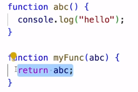
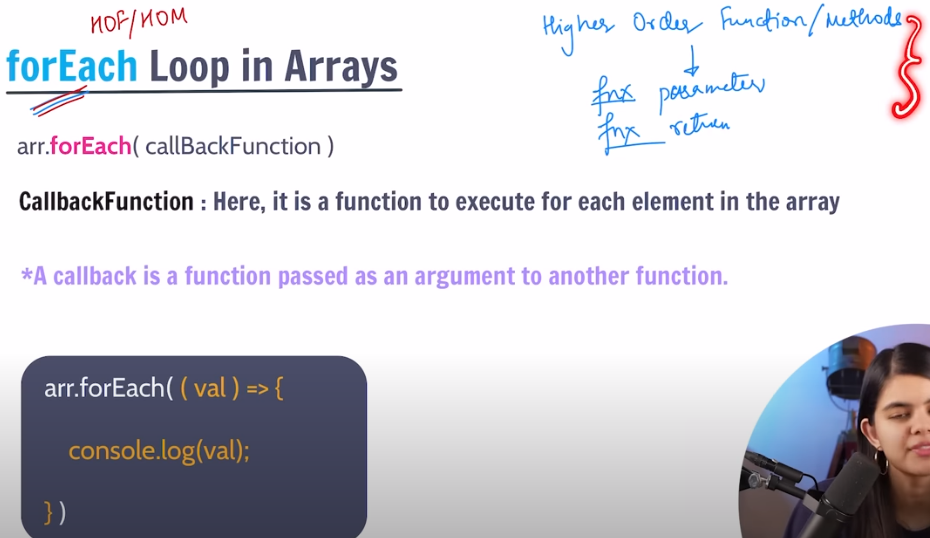
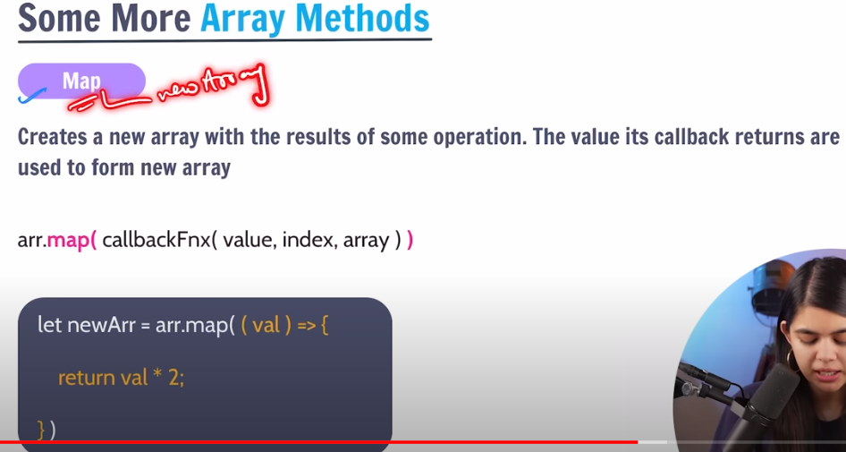
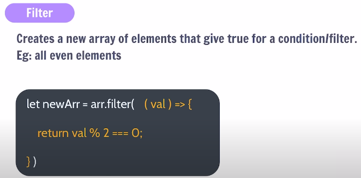

# IMP QS FOR INTERVIEW 

### 1. let vs const vs var
   * for-in
   * for-of loops

### 2. Strings [Immutable] - Template Literals (`add expressions in strings ${}`)

### 3. String Interpolation - same

### 4. String Methods - Manipulate String

### 5. Arrays [Mutable] - 
### 6. To traverse array - Use strictly for-of loop
### 7. Array Methods : 2ways (one change array , one don't change)
   * slice 
   * splice
### 8. Fuctions - params ->block scope
   * Arrow Fuctions - fuction variable  

### Array Methos :

### 9. In Js Fuctions can be passed as an argument to a fuction.
 

### 10. **forEach Loop : to do calculations on same array
 

### 11. **map : to create new array
 

### 12. **filter : filter val and put in new array
 